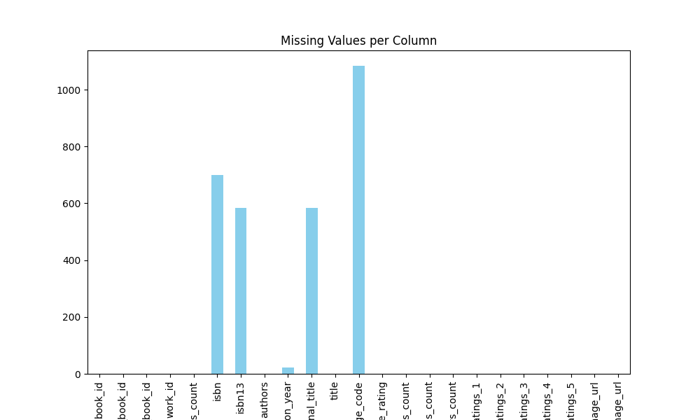

# Automated Analysis Results

## Dataset Overview
Columns: book_id, goodreads_book_id, best_book_id, work_id, books_count, isbn, isbn13, authors, original_publication_year, original_title, title, language_code, average_rating, ratings_count, work_ratings_count, work_text_reviews_count, ratings_1, ratings_2, ratings_3, ratings_4, ratings_5, image_url, small_image_url

## Data Types
{'book_id': 'int64', 'goodreads_book_id': 'int64', 'best_book_id': 'int64', 'work_id': 'int64', 'books_count': 'int64', 'isbn': 'object', 'isbn13': 'float64', 'authors': 'object', 'original_publication_year': 'float64', 'original_title': 'object', 'title': 'object', 'language_code': 'object', 'average_rating': 'float64', 'ratings_count': 'int64', 'work_ratings_count': 'int64', 'work_text_reviews_count': 'int64', 'ratings_1': 'int64', 'ratings_2': 'int64', 'ratings_3': 'int64', 'ratings_4': 'int64', 'ratings_5': 'int64', 'image_url': 'object', 'small_image_url': 'object'}

## Summary Statistics
{'book_id': {'count': 10000.0, 'unique': nan, 'top': nan, 'freq': nan, 'mean': 5000.5, 'std': 2886.8956799071675, 'min': 1.0, '25%': 2500.75, '50%': 5000.5, '75%': 7500.25, 'max': 10000.0}, 'goodreads_book_id': {'count': 10000.0, 'unique': nan, 'top': nan, 'freq': nan, 'mean': 5264696.5132, 'std': 7575461.863589611, 'min': 1.0, '25%': 46275.75, '50%': 394965.5, '75%': 9382225.25, 'max': 33288638.0}, 'best_book_id': {'count': 10000.0, 'unique': nan, 'top': nan, 'freq': nan, 'mean': 5471213.5801, 'std': 7827329.890719961, 'min': 1.0, '25%': 47911.75, '50%': 425123.5, '75%': 9636112.5, 'max': 35534230.0}, 'work_id': {'count': 10000.0, 'unique': nan, 'top': nan, 'freq': nan, 'mean': 8646183.4246, 'std': 11751060.824080039, 'min': 87.0, '25%': 1008841.0, '50%': 2719524.5, '75%': 14517748.25, 'max': 56399597.0}, 'books_count': {'count': 10000.0, 'unique': nan, 'top': nan, 'freq': nan, 'mean': 75.7127, 'std': 170.47072765025834, 'min': 1.0, '25%': 23.0, '50%': 40.0, '75%': 67.0, 'max': 3455.0}, 'isbn': {'count': 9300, 'unique': 9300, 'top': '375700455', 'freq': 1, 'mean': nan, 'std': nan, 'min': nan, '25%': nan, '50%': nan, '75%': nan, 'max': nan}, 'isbn13': {'count': 9415.0, 'unique': nan, 'top': nan, 'freq': nan, 'mean': 9755044298883.463, 'std': 442861920665.57336, 'min': 195170342.0, '25%': 9780316192995.0, '50%': 9780451528640.0, '75%': 9780830777175.0, 'max': 9790007672390.0}, 'authors': {'count': 10000, 'unique': 4664, 'top': 'Stephen King', 'freq': 60, 'mean': nan, 'std': nan, 'min': nan, '25%': nan, '50%': nan, '75%': nan, 'max': nan}, 'original_publication_year': {'count': 9979.0, 'unique': nan, 'top': nan, 'freq': nan, 'mean': 1981.987674115643, 'std': 152.57666516754668, 'min': -1750.0, '25%': 1990.0, '50%': 2004.0, '75%': 2011.0, 'max': 2017.0}, 'original_title': {'count': 9415, 'unique': 9274, 'top': ' ', 'freq': 5, 'mean': nan, 'std': nan, 'min': nan, '25%': nan, '50%': nan, '75%': nan, 'max': nan}, 'title': {'count': 10000, 'unique': 9964, 'top': 'Selected Poems', 'freq': 4, 'mean': nan, 'std': nan, 'min': nan, '25%': nan, '50%': nan, '75%': nan, 'max': nan}, 'language_code': {'count': 8916, 'unique': 25, 'top': 'eng', 'freq': 6341, 'mean': nan, 'std': nan, 'min': nan, '25%': nan, '50%': nan, '75%': nan, 'max': nan}, 'average_rating': {'count': 10000.0, 'unique': nan, 'top': nan, 'freq': nan, 'mean': 4.002191000000001, 'std': 0.25442748053872905, 'min': 2.47, '25%': 3.85, '50%': 4.02, '75%': 4.18, 'max': 4.82}, 'ratings_count': {'count': 10000.0, 'unique': nan, 'top': nan, 'freq': nan, 'mean': 54001.2351, 'std': 157369.95643554674, 'min': 2716.0, '25%': 13568.75, '50%': 21155.5, '75%': 41053.5, 'max': 4780653.0}, 'work_ratings_count': {'count': 10000.0, 'unique': nan, 'top': nan, 'freq': nan, 'mean': 59687.3216, 'std': 167803.7852374182, 'min': 5510.0, '25%': 15438.75, '50%': 23832.5, '75%': 45915.0, 'max': 4942365.0}, 'work_text_reviews_count': {'count': 10000.0, 'unique': nan, 'top': nan, 'freq': nan, 'mean': 2919.9553, 'std': 6124.378131569911, 'min': 3.0, '25%': 694.0, '50%': 1402.0, '75%': 2744.25, 'max': 155254.0}, 'ratings_1': {'count': 10000.0, 'unique': nan, 'top': nan, 'freq': nan, 'mean': 1345.0406, 'std': 6635.626262783459, 'min': 11.0, '25%': 196.0, '50%': 391.0, '75%': 885.0, 'max': 456191.0}, 'ratings_2': {'count': 10000.0, 'unique': nan, 'top': nan, 'freq': nan, 'mean': 3110.885, 'std': 9717.123578396993, 'min': 30.0, '25%': 656.0, '50%': 1163.0, '75%': 2353.25, 'max': 436802.0}, 'ratings_3': {'count': 10000.0, 'unique': nan, 'top': nan, 'freq': nan, 'mean': 11475.8938, 'std': 28546.449183182456, 'min': 323.0, '25%': 3112.0, '50%': 4894.0, '75%': 9287.0, 'max': 793319.0}, 'ratings_4': {'count': 10000.0, 'unique': nan, 'top': nan, 'freq': nan, 'mean': 19965.6966, 'std': 51447.35838380058, 'min': 750.0, '25%': 5405.75, '50%': 8269.5, '75%': 16023.5, 'max': 1481305.0}, 'ratings_5': {'count': 10000.0, 'unique': nan, 'top': nan, 'freq': nan, 'mean': 23789.8056, 'std': 79768.88561077163, 'min': 754.0, '25%': 5334.0, '50%': 8836.0, '75%': 17304.5, 'max': 3011543.0}, 'image_url': {'count': 10000, 'unique': 6669, 'top': 'https://s.gr-assets.com/assets/nophoto/book/111x148-bcc042a9c91a29c1d680899eff700a03.png', 'freq': 3332, 'mean': nan, 'std': nan, 'min': nan, '25%': nan, '50%': nan, '75%': nan, 'max': nan}, 'small_image_url': {'count': 10000, 'unique': 6669, 'top': 'https://s.gr-assets.com/assets/nophoto/book/50x75-a91bf249278a81aabab721ef782c4a74.png', 'freq': 3332, 'mean': nan, 'std': nan, 'min': nan, '25%': nan, '50%': nan, '75%': nan, 'max': nan}}

## Missing Values
{'book_id': 0, 'goodreads_book_id': 0, 'best_book_id': 0, 'work_id': 0, 'books_count': 0, 'isbn': 700, 'isbn13': 585, 'authors': 0, 'original_publication_year': 21, 'original_title': 585, 'title': 0, 'language_code': 1084, 'average_rating': 0, 'ratings_count': 0, 'work_ratings_count': 0, 'work_text_reviews_count': 0, 'ratings_1': 0, 'ratings_2': 0, 'ratings_3': 0, 'ratings_4': 0, 'ratings_5': 0, 'image_url': 0, 'small_image_url': 0}

## Insights
Based on the provided dataset summary, we'll derive some key insights and suggest relevant visualizations.

### Key Insights

1. **General Overview:**
   - The dataset contains a total of 10,000 books.
   - The average `average_rating` is approximately 4.00, suggesting a generally positive reception among readers.
   - The average `ratings_count` is around 54,001, indicating high engagement with the books.

2. **Author Popularity:**
   - There are 4,664 unique authors, with the most frequent author being Stephen King (60 books).
   - This indicates that certain authors dominate the dataset, which may have implications for genre popularity or market reach.

3. **Publication Trends:**
   - The `original_publication_year` has a mean of ~1982 with a minimum of -1750 and maximum of 2017. This implies that the dataset contains both contemporary and classical literature.
   - The quartiles reveal that 75% of the books were originally published before 2011, showing a longer historical range in book publication.

4. **Language Distribution:**
   - There are 25 unique language codes, with English (`eng`) being the most common (6,341 instances).
   - The `language_code` column has a notable number of missing values (1,084), which could affect analyses on non-English language books.

5. **Rating Distribution:**
   - The scores from `ratings_1` to `ratings_5` reflect substantial variability, with a mean of approximately 23,790 for 5-star ratings and 1,345 for 1-star ratings. This aligns with the positive average rating.
   - Notably, there is a large standard deviation for all rating categories, indicating varying experiences and opinions about the same books.

6. **ISBN Data:**
   - There are 700 missing ISBNs, which limits the dataset's completeness for unique book identification. It's important for pricing and purchase tracking.

7. **Visual Cues for Engagement:**
   - The ratings and reviews data suggest that certain books garner more reviews and ratings, reflecting their popularity and presence in the literary market.

### Suggested Visualizations

1. **Distribution of Average Ratings:**
   - Create a histogram to visualize the distribution of `average_rating`. It may help identify any skewness or outliers in book ratings.

2. **Ratings Score Breakdown:**
   - A bar chart showing the count of ratings from 1 to 5 stars can provide a clear view of reader preferences and engagement.

3. **Publication Year Trend:**
   - A line plot displaying the number of books published per year could show trends in literature across decades.

4. **Author Popularity:**
   - A bar chart depicting the top authors by the number of books can help visualize who is most prevalent in the dataset.

5. **Language Representation:**
   - A pie chart or bar graph could be utilized to show the proportion of books available in different languages. This could illuminate the market focus.

6. **Correlation Heatmap:**
   - A heatmap showing the correlation between various numerical features (like `average_rating`, `ratings_count`, `work_ratings_count`) can help in determining if high ratings correlate with higher reviews or counts of ratings.

7. **Boxplot of Ratings by Author:**
   - A boxplot can be used to illustrate the distribution of average ratings across different authors, showing who has the highest-rated works.

8. **Missing Value Analysis:**
   - A bar plot illustrating the count of missing values for each column can guide data cleaning efforts.

### Conclusion

The dataset provides rich insights into book ratings, publication trends, and author popularity. Analyzing these elements through appropriate visualizations can facilitate deeper understanding and support recommendations or further investigations into the literary market.

## Visualizations

