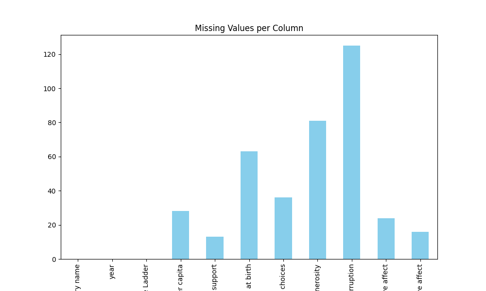

# Automated Analysis Results

## Dataset Overview
Columns: Country name, year, Life Ladder, Log GDP per capita, Social support, Healthy life expectancy at birth, Freedom to make life choices, Generosity, Perceptions of corruption, Positive affect, Negative affect

## Data Types
{'Country name': 'object', 'year': 'int64', 'Life Ladder': 'float64', 'Log GDP per capita': 'float64', 'Social support': 'float64', 'Healthy life expectancy at birth': 'float64', 'Freedom to make life choices': 'float64', 'Generosity': 'float64', 'Perceptions of corruption': 'float64', 'Positive affect': 'float64', 'Negative affect': 'float64'}

## Summary Statistics
{'Country name': {'count': 2363, 'unique': 165, 'top': 'Argentina', 'freq': 18, 'mean': nan, 'std': nan, 'min': nan, '25%': nan, '50%': nan, '75%': nan, 'max': nan}, 'year': {'count': 2363.0, 'unique': nan, 'top': nan, 'freq': nan, 'mean': 2014.7638595006347, 'std': 5.059436468192795, 'min': 2005.0, '25%': 2011.0, '50%': 2015.0, '75%': 2019.0, 'max': 2023.0}, 'Life Ladder': {'count': 2363.0, 'unique': nan, 'top': nan, 'freq': nan, 'mean': 5.483565806178587, 'std': 1.1255215132391925, 'min': 1.281, '25%': 4.647, '50%': 5.449, '75%': 6.3235, 'max': 8.019}, 'Log GDP per capita': {'count': 2335.0, 'unique': nan, 'top': nan, 'freq': nan, 'mean': 9.399671092077089, 'std': 1.1520694444710216, 'min': 5.527, '25%': 8.506499999999999, '50%': 9.503, '75%': 10.3925, 'max': 11.676}, 'Social support': {'count': 2350.0, 'unique': nan, 'top': nan, 'freq': nan, 'mean': 0.8093693617021277, 'std': 0.12121176420299144, 'min': 0.228, '25%': 0.744, '50%': 0.8345, '75%': 0.904, 'max': 0.987}, 'Healthy life expectancy at birth': {'count': 2300.0, 'unique': nan, 'top': nan, 'freq': nan, 'mean': 63.40182826086957, 'std': 6.842644351828009, 'min': 6.72, '25%': 59.195, '50%': 65.1, '75%': 68.5525, 'max': 74.6}, 'Freedom to make life choices': {'count': 2327.0, 'unique': nan, 'top': nan, 'freq': nan, 'mean': 0.750281908036098, 'std': 0.13935703459253465, 'min': 0.228, '25%': 0.661, '50%': 0.771, '75%': 0.862, 'max': 0.985}, 'Generosity': {'count': 2282.0, 'unique': nan, 'top': nan, 'freq': nan, 'mean': 9.772129710780206e-05, 'std': 0.16138760312630687, 'min': -0.34, '25%': -0.112, '50%': -0.022, '75%': 0.09375, 'max': 0.7}, 'Perceptions of corruption': {'count': 2238.0, 'unique': nan, 'top': nan, 'freq': nan, 'mean': 0.7439709562109026, 'std': 0.1848654805936834, 'min': 0.035, '25%': 0.687, '50%': 0.7985, '75%': 0.86775, 'max': 0.983}, 'Positive affect': {'count': 2339.0, 'unique': nan, 'top': nan, 'freq': nan, 'mean': 0.6518820008550662, 'std': 0.10623970474397627, 'min': 0.179, '25%': 0.572, '50%': 0.663, '75%': 0.737, 'max': 0.884}, 'Negative affect': {'count': 2347.0, 'unique': nan, 'top': nan, 'freq': nan, 'mean': 0.27315083084789094, 'std': 0.08713107245795021, 'min': 0.083, '25%': 0.209, '50%': 0.262, '75%': 0.326, 'max': 0.705}}

## Missing Values
{'Country name': 0, 'year': 0, 'Life Ladder': 0, 'Log GDP per capita': 28, 'Social support': 13, 'Healthy life expectancy at birth': 63, 'Freedom to make life choices': 36, 'Generosity': 81, 'Perceptions of corruption': 125, 'Positive affect': 24, 'Negative affect': 16}

## Insights
Based on the dataset summary you provided, here are some key insights and suggestions for visualizations:

### Key Insights:

1. **Data Overview**:
   - The dataset contains 2,363 records across 165 unique countries, with a mixture of quantitative measures related to quality of life and happiness indicators.
   - The years in the dataset range from 2005 to 2023, providing a temporal overview of changes or trends.

2. **Life Ladder (Happiness) Distribution**:
   - The average Life Ladder score is approximately 5.48, which suggests a moderate level of happiness globally. The range is from 1.281 to 8.019, indicating disparities in happiness across different countries.

3. **Economic Context**:
   - The average Log GDP per capita is around 9.40 (with a range from 5.527 to 11.676), indicating variations in economic wealth. A potential correlation between GDP and Life Ladder ratings can be explored.

4. **Social Support**:
   - The average social support score is 0.809, with a maximum of 0.987. This figure suggests that social support is generally perceived positively across most countries.

5. **Healthy Life Expectancy**:
   - The average healthy life expectancy at birth is about 63.4 years with a range from 6.72 to 74.6 years, indicating significant disparities in health outcomes.

6. **Freedom to Make Life Choices**:
   - The mean score of 0.75 suggests that individuals generally feel a moderate to high level of freedom in their life choices.

7. **Perceptions of Corruption**:
   - The mean score of 0.744 implies that a significant number of respondents perceive corruption in their countries, with a maximum of 0.983 indicating areas of extreme concern.

8. **Affective Measures**:
   - Positive affect averages at about 0.652, suggesting that, generally, people feel a moderate amount of positive emotions.
   - Negative affect averages around 0.273, indicating that negative feelings are less prevalent among the surveyed population.

### Missing Values:
- Missing data exists for several key variables (e.g., Log GDP per capita has 28 missing entries). This should be addressed, perhaps with imputation strategies or exclusion of affected records based on the specific analysis being conducted.

### Suggested Visualizations:

1. **Distribution of Life Ladder Scores**:
   - Histogram or KDE plot to visualize the distribution of the Life Ladder scores. This will help illustrate how happiness varies across the dataset.

2. **Correlation Heatmap**:
   - A heatmap showing correlation coefficients between numerical variables. This can quickly reveal relationships, such as between GDP and happiness, or social support and life satisfaction.

3. **Box Plots by Country**:
   - Box plots for Life Ladder scores by country can show the variation and outliers in happiness across different countries.

4. **Time Series Analysis**:
   - Line charts showing trends in Life Ladder, Log GDP per capita, and other metrics over the years. This will highlight any changes over time that may correlate with policy changes or global events.

5. **Scatter Plots**:
   - Scatter plots to analyze relationships, such as GDP vs. Life Ladder and social support vs. Life Ladder, with regression lines to assess the strength of these relationships.

6. **World Map Visualization**:
   - A choropleth map to visualize Life Ladder scores or Healthy Life Expectancy at birth by country. This provides a geographic perspective on the quality of life metrics.

7. **Bar Charts**:
   - Bar charts for categorical insights, such as average happiness scores for regions or the top and bottom countries in each measure (e.g., GDP, social support).

8. **Handling Missing Values**:
   - A summary plot showing the number of missing values across the variables could provide insight into areas needing attention.

By taking these insights and visualizations into account, we can better analyze the dataset and uncover deeper stories within the data regarding happiness, quality of life, and the underlying factors associated with them.

## Visualizations

