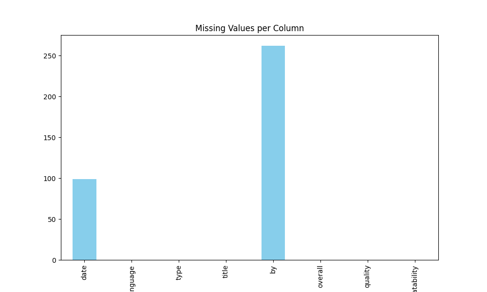

# Automated Analysis Results

## Dataset Overview
Columns: date, language, type, title, by, overall, quality, repeatability

## Data Types
{'date': 'object', 'language': 'object', 'type': 'object', 'title': 'object', 'by': 'object', 'overall': 'int64', 'quality': 'int64', 'repeatability': 'int64'}

## Summary Statistics
{'date': {'count': 2553, 'unique': 2055, 'top': '21-May-06', 'freq': 8, 'mean': nan, 'std': nan, 'min': nan, '25%': nan, '50%': nan, '75%': nan, 'max': nan}, 'language': {'count': 2652, 'unique': 11, 'top': 'English', 'freq': 1306, 'mean': nan, 'std': nan, 'min': nan, '25%': nan, '50%': nan, '75%': nan, 'max': nan}, 'type': {'count': 2652, 'unique': 8, 'top': 'movie', 'freq': 2211, 'mean': nan, 'std': nan, 'min': nan, '25%': nan, '50%': nan, '75%': nan, 'max': nan}, 'title': {'count': 2652, 'unique': 2312, 'top': 'Kanda Naal Mudhal', 'freq': 9, 'mean': nan, 'std': nan, 'min': nan, '25%': nan, '50%': nan, '75%': nan, 'max': nan}, 'by': {'count': 2390, 'unique': 1528, 'top': 'Kiefer Sutherland', 'freq': 48, 'mean': nan, 'std': nan, 'min': nan, '25%': nan, '50%': nan, '75%': nan, 'max': nan}, 'overall': {'count': 2652.0, 'unique': nan, 'top': nan, 'freq': nan, 'mean': 3.0475113122171944, 'std': 0.7621797580962717, 'min': 1.0, '25%': 3.0, '50%': 3.0, '75%': 3.0, 'max': 5.0}, 'quality': {'count': 2652.0, 'unique': nan, 'top': nan, 'freq': nan, 'mean': 3.2092760180995477, 'std': 0.7967426636666686, 'min': 1.0, '25%': 3.0, '50%': 3.0, '75%': 4.0, 'max': 5.0}, 'repeatability': {'count': 2652.0, 'unique': nan, 'top': nan, 'freq': nan, 'mean': 1.4947209653092006, 'std': 0.598289430580212, 'min': 1.0, '25%': 1.0, '50%': 1.0, '75%': 2.0, 'max': 3.0}}

## Missing Values
{'date': 99, 'language': 0, 'type': 0, 'title': 0, 'by': 262, 'overall': 0, 'quality': 0, 'repeatability': 0}

## Insights
Based on the provided dataset summary, here are some key insights and suggested visualizations that can be derived from the data:

### Key Insights:

1. **Date Distribution**:
   - The dataset has 2,553 entries with 2,055 unique dates, indicating a potentially wide range of data collection.
   - The fact that a single date ('21-May-06') has the highest frequency (8) suggests that data might be collected repeatedly on specific days.

2. **Language**:
   - The dataset includes 11 unique languages, with 'English' being the most frequent language (1,306 occurrences).
   - This suggests a possible bias towards English content in the dataset.

3. **Type of Content**:
   - The majority of the entries (2,211) are classified as 'movie', making up a significant proportion of the dataset.
   - Other types may be less frequent, which could suggest a need to analyze and understand the distribution of other content types.

4. **Titles and Contributors**:
   - There are 2,312 unique titles with 'Kanda Naal Mudhal' being the most frequent (9 occurrences).
   - 'Kiefer Sutherland' is the most common contributor (48 occurrences), indicating some concentration of contributors or artists.

5. **Ratings**:
   - The `overall` rating has a mean of approximately 3.05, with a max of 5. This indicates a generally positive perception of the content, but there's also room for improvement.
   - The `quality` metric is slightly higher (mean of ~3.21), indicating that quality perceptions may be better than overall enjoyment.
   - The `repeatability` scores are predominantly low (1 and 2), suggesting that titles may not be frequently revisited or reviewed by users.

6. **Missing Values**:
   - There are 99 missing dates and 262 missing contributors (by). Understanding why this data is missing could provide insights into data collection practices or challenges.

### Suggested Visualizations:

1. **Time Series Analysis**:
   - Create a line chart to visualize the number of entries over time. This could show trends in data entry frequency, potential spikes on certain dates or periods.

2. **Language Distribution Pie Chart**:
   - A pie chart or bar graph to visualize the proportion of entries by language, highlighting the dominance of English.

3. **Content Type Distribution**:
   - A bar chart showing the counts of different types of content (e.g., movies, shows, etc.) to provide insight into the diversity of types within the dataset.

4. **Top Contributors and Titles**:
   - Horizontal bar charts to showcase the most frequent contributors and titles, highlighting patterns in popular content.

5. **Rating Distributions Box Plots**:
   - Box plots for `overall`, `quality`, and `repeatability` ratings to illustrate their distributions, including medians, quartiles, and potential outliers.

6. **Missing Data Heatmap**:
   - A heatmap showing the distribution of missing values across different categories to better understand where data collection might be lacking.

7. **Correlation Matrix**:
   - A correlation matrix heatmap to visualize relationships between numerical attributes (`overall`, `quality`, `repeatability`). This could reveal if higher quality tends to correlate with higher overall ratings.

Each of these insights and visualizations can help in understanding the patterns within your dataset, guiding impactful decisions for content recommendations, data cleaning, or further analytical exploration.

## Visualizations

